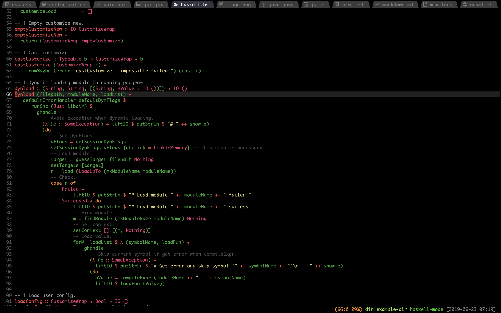

Table of Contents
=================

* [What is it?](#what-is-it)
     * [Installation](#installation)
     * [Usage](#usage)
     * [Plugins](#plugins)
     * [Customize](#customize)
        * [Icon](#icon)
        * [Theme](#theme)
        * [TabStyle](#tabstyle)
        * [HideRules](#hiderules)
        * [GroupRules](#grouprules)
        * [FixedWidth](#fixedwidth)
        * [DisplayFunctionName](#displayfunctionname)

# What is it?

Emacs package to provide out-of-the-box configuration to use tabs.

### Installation

1. Clone this repository

```
git clone --depth=1 https://github.com/manateelazycat/awesome-tab.git
```

2. Move awesome-tab.el to your load-path.

    The load-path is usually `~/elisp/`.

    It's set in your `~/.emacs` or `~/.emacs.d/init.el` like this:

```Elisp
(add-to-list 'load-path (expand-file-name "~/elisp"))

(require 'awesome-tab)

(awesome-tab-mode t)
```

2. If you are using [Use-packge](https://github.com/jwiegley/use-package), the configuration will look like this

```ELisp
(use-package awesome-tab
  :load-path "path/to/your/awesome-tab.el"
  :config
  (awesome-tab-mode t)
)
```

3. Reload your emacs configuration using `M-x eval-buffer` or restarting emacs


### Usage

| Command                                         | Description                                                                           |
| :--------                                       | :----                                                                                 |
| awesome-tab-switch-group                        | Switch awesome-tab group by ido fuzz match                                            |
| awesome-tab-select-beg-tab                      | Select first tab of current group                                                     |
| awesome-tab-select-end-tab                      | Select last tab of current group                                                      |
| awesome-tab-forward-tab-other-window            | Select next tab in other window                                                       |
| awesome-tab-backward-tab-other-window           | Select previous tab in other window                                                   |
| awesome-tab-backward-tab                        | Select the previous available tab                                                     |
| awesome-tab-forward-tab                         | Select the next available tab                                                         |
| awesome-tab-backward-group                      | Go to selected tab in the previous available group                                    |
| awesome-tab-forward-group                       | Go to selected tab in the next available group                                        |
| awesome-tab-backward                            | Select the previous available tab, depend on setting of ```awesome-tab-cycle-scope``` |
| awesome-tab-forward                             | Select the next available tab, depend on setting of ```awesome-tab-cycle-scope```     |
| awesome-tab-kill-other-buffers-in-current-group | Kill other buffers of current group                                                   |
| awesome-tab-kill-all-buffers-in-current-group   | Kill all buffers of current group                                                     |
| awesome-tab-kill-match-buffers-in-current-group | Kill buffers match extension of current group                                         |
| awesome-tab-keep-match-buffers-in-current-group | Keep buffers match extension of current group                                         |
| awesome-tab-move-current-tab-to-left            | Move current tab to left                                                              |
| awesome-tab-move-current-tab-to-right           | Move current tab to right                                                             |
| awesome-tab-move-current-tab-to-beg             | Move current tab to the first position                                                |
| awesome-tab-select-visible-tab                  | Select visible tab with given index                                                   |
| awesome-tab-ace-jump                            | Jump to visible tab with 1 or 2 characters press                                      |

*Tip:* When jumping to a tab far away, think if it will be frequently used. If the answer is yes, move it to the first position. By doing so you keep all your frequently used tabs to be in the first screen, so you have easy access to them.

#### Ace jump

Call command ```awesome-tab-ace-jump```, and a sequence of 1 or 2 characters will show on tabs in the current tab group. Type them to jump to that tab.

Customize ```awesome-tab-ace-keys``` to specify the used characters. The default value is `j`, `k`, `l`, `s`, `d`, `f`. Notice that this variable has the `custom-set` attribute, so `setq` won't work. Use `customize-set-variable` instead.

Customize ```awesome-tab-ace-str-style``` to specify the position of ace sequences on the tab. You can choose ```'replace-icon```, ```'left``` or ```'right```.

Customize ```awesome-tab-ace-quit-keys``` to specify keys used to quit from ace jumping. The default value is ```'(?\C-g ?q ?\s)```, you can press ```C-g``` ```q``` or ```SPC``` to quit from ace jumping. Anyway, you can customize any other keys you like.

```Elisp
(setq awesome-tab-ace-quit-keys '(?\C-g))
```

If you are a hydra user, you can use this to do consecutive moves between tabs and windows:

```Elisp
(defhydra awesome-fast-switch (:hint nil)
  "
 ^^^^Fast Move             ^^^^Tab                    ^^Search            ^^Misc
-^^^^--------------------+-^^^^---------------------+-^^----------------+-^^---------------------------
   ^_k_^   prev group    | _C-a_^^     select first | _b_ search buffer | _C-k_   kill buffer
 _h_   _l_  switch tab   | _C-e_^^     select last  | _g_ search group  | _C-S-k_ kill others in group
   ^_j_^   next group    | _C-j_^^     ace jump     | ^^                | ^^
 ^^0 ~ 9^^ select window | _C-h_/_C-l_ move current | ^^                | ^^
-^^^^--------------------+-^^^^---------------------+-^^----------------+-^^---------------------------
"
  ("h" awesome-tab-backward-tab)
  ("j" awesome-tab-forward-group)
  ("k" awesome-tab-backward-group)
  ("l" awesome-tab-forward-tab)
  ("0" my-select-window)
  ("1" my-select-window)
  ("2" my-select-window)
  ("3" my-select-window)
  ("4" my-select-window)
  ("5" my-select-window)
  ("6" my-select-window)
  ("7" my-select-window)
  ("8" my-select-window)
  ("9" my-select-window)
  ("C-a" awesome-tab-select-beg-tab)
  ("C-e" awesome-tab-select-end-tab)
  ("C-j" awesome-tab-ace-jump)
  ("C-h" awesome-tab-move-current-tab-to-left)
  ("C-l" awesome-tab-move-current-tab-to-right)
  ("b" ivy-switch-buffer)
  ("g" awesome-tab-counsel-switch-group)
  ("C-k" kill-current-buffer)
  ("C-S-k" awesome-tab-kill-other-buffers-in-current-group)
  ("q" nil "quit"))
```

where ```my-select-window``` is a command that automatically recognizes the number in your keystroke and switch to that window. Below is an implementation using ```ace-window```:

```Elisp
;; winum users can use `winum-select-window-by-number' directly.
(defun my-select-window-by-number (win-id)
  "Use `ace-window' to select the window by using window index.
WIN-ID : Window index."
  (let ((wnd (nth (- win-id 1) (aw-window-list))))
    (if wnd
        (aw-switch-to-window wnd)
      (message "No such window."))))

(defun my-select-window ()
  (interactive)
  (let* ((event last-input-event)
         (key (make-vector 1 event))
         (key-desc (key-description key)))
    (my-select-window-by-number
     (string-to-number (car (nreverse (split-string key-desc "-"))))))))
```

#### Switch tab with given index

You can bind the number keys to the command ```awesome-tab-select-visible-tab```, such as s-1, s-2, s-3 ... etc.

```Elisp
(global-set-key (kbd "s-1") 'awesome-tab-select-visible-tab)
(global-set-key (kbd "s-2") 'awesome-tab-select-visible-tab)
(global-set-key (kbd "s-3") 'awesome-tab-select-visible-tab)
(global-set-key (kbd "s-4") 'awesome-tab-select-visible-tab)
(global-set-key (kbd "s-5") 'awesome-tab-select-visible-tab)
(global-set-key (kbd "s-6") 'awesome-tab-select-visible-tab)
(global-set-key (kbd "s-7") 'awesome-tab-select-visible-tab)
(global-set-key (kbd "s-8") 'awesome-tab-select-visible-tab)
(global-set-key (kbd "s-9") 'awesome-tab-select-visible-tab)
(global-set-key (kbd "s-0") 'awesome-tab-select-visible-tab)
```

This function automatically recognizes the number at the end of the keystroke
and switches to the tab of the corresponding index.

Note that this function switches to the visible range,
not the actual logical index position of the current group.

### Plugins
If you're a helm fan, you need to add below code in your helm config,

```Elisp
(awesome-tab-build-helm-source)
```

Then add ```helm-source-awesome-tab-group``` to ```helm-source-list```.

Ivy fans can use the ```awesome-tab-counsel-switch-group``` function instead.

### Customize

#### Icon
If you have install [AllTheIcons](https://github.com/domtronn/all-the-icons.el) successfully.
AwesomeTab will render file icon in tab automatically.

If you dislike icon render in tab and still need use ```all-the-icons``` plugin,
you can set variable ```awesome-tab-display-icon``` with nil.

#### Theme
Tab color will change with current theme, you don't need customize the color tab.

Emacs may not detect your theme style (light/dark) in the terminal correctly.
You may need to set `frame-background-mode` manually to have correct tab (and text) colors:

```Elisp
(when (not (display-graphic-p))
  (setq frame-background-mode 'dark))
```

#### TabStyle
Default tab style is "wave", you can customize option ```awesome-tab-style``` follow your preferences, below are the different tab style screenshots:

##### alternate


##### bar


##### box


##### chamfer


##### rounded


##### slant


##### wave


##### zigzag


##### HideRules
Awesome tab hide some tabs with regular expression that controller by function ```awesome-tab-hide-tab-function```

Default hide function is ```awesome-hide-tab```

```Elisp
(defun awesome-tab-hide-tab (x)
  (let ((name (format "%s" x)))
    (or
     (string-prefix-p "*epc" name)
     (string-prefix-p "*helm" name)
     (string-prefix-p "*Compile-Log*" name)
     (string-prefix-p "*lsp" name)
     (and (string-prefix-p "magit" name)
               (not (file-name-extension name)))
     )))
```

Tab will hide if ```awesome-tab-hide-tab-function``` return t, you can write your own code to customize hide rules.

##### GroupRules
Awesome tab use ```awesome-tab-buffer-groups-function``` to control tab group.
Default group function is ```awesome-tab-buffer-groups```

```Elisp
(defun awesome-tab-buffer-groups ()
  "`awesome-tab-buffer-groups' control buffers' group rules.

Group awesome-tab with mode if buffer is derived from `eshell-mode' `emacs-lisp-mode' `dired-mode' `org-mode' `magit-mode'.
All buffer name start with * will group to \"Emacs\".
Other buffer group by `awesome-tab-get-group-name' with project name."
  (list
   (cond
    ((or (string-equal "*" (substring (buffer-name) 0 1))
         (memq major-mode '(magit-process-mode
                            magit-status-mode
                            magit-diff-mode
                            magit-log-mode
                            magit-file-mode
                            magit-blob-mode
                            magit-blame-mode
                            )))
     "Emacs")
    ((derived-mode-p 'eshell-mode)
     "EShell")
    ((derived-mode-p 'emacs-lisp-mode)
     "Elisp")
    ((derived-mode-p 'dired-mode)
     "Dired")
    ((memq major-mode '(org-mode org-agenda-mode diary-mode))
     "OrgMode")
    (t
     (awesome-tab-get-group-name (current-buffer))))))
```

This function is very simple switch logic, you can write your own code to group tabs.

##### FixedWidth

If you'd like all the tab labels using the same length, such as 14, use:

```Elisp
(setq awesome-tab-label-fixed-length 14)
```

##### DisplayFunctionName
If the implementation of the function where the cursor is located is longer than the screen,
it is difficult to know what the current function.

You can set variable ```awesome-tab-display-sticky-function-name``` with t,
then function name will display in current tab.

Default this feature is disable.
